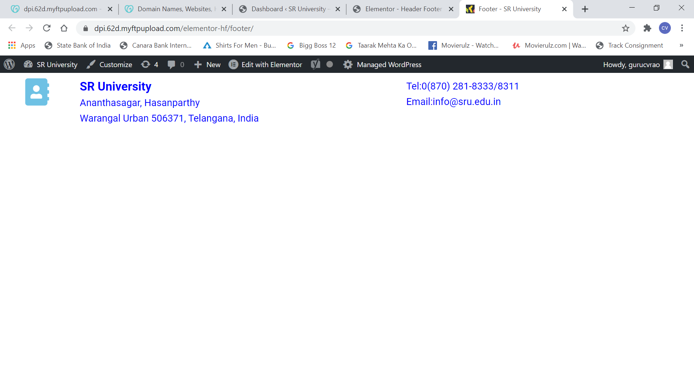

"# SPS-8478-Education-Domain"

# "By Dr.C.V.Guru Rao"

[My repository link](https://github.com/smartinternz02/SPS-8478-Education-Domain.git, "Education Domain Website")

## Education Domain Website

This repository is to present a website built using WordPress as part of GoDaddy Web Build-A-Thon in the Education Domain and hosting it on GoDaddy provided website hosting space.

## Prerequisites  

* To develop a website locally, one must be familiar with Wordpress. 

* The account requires an Wordpress id. 

* The Wordpress provides access to everything you need to develop, design, track, plan, and deploy it.

* An account with GoDaddy Academy is required to complete the courses of Understanding websites and Working with Wordpress.
1.Sign up at GoDaddy Academy

2.Register to Prescribed Courses at GoDaddy Academy

3.Status of Courses completed by me at GoDaddy Academy

* An account at GoDaddy to host the website and get Domain name

* It need a clone of this GitHub repository, as one might need some of the files to expedite the work.

## Steps to Implement a website for Education Domain

##__Create an account at Wordpress website__

Download and install Bitnami Wordpress to create an account to participate in GoDaddy-SmartBridge Web Build-A-Thon.

##__Login onto Wordpress account__

A login page at Wordpress, to sign into an account created at Wordpress.

##__Dash Board of Wordpress account__

Wordpress Dashboard of an account after signing in.

Downloaad and Set the theme of Website to Astra that is available in Wordpress.

##__Add a Homepage from dashboard__

Using Wordpress dashboard go to all pages and add a Homepage.

##__Customize Homepage in Wordpress__

Customize the Homepage created first in the Wordpress.

##__Customize Logo on Homepage__

Set the appropriate size, title and tagline of Logo in the Wordpress website.

##__Customize Menu on Homepage__

Create Primary Menu on Home page and set to display on all pages.

##__Customize Homepage display__

Set the display of site homepage to this Homepage.

##__Complete rest of the Homepage using Elementor__

Rest of the sections of Homepage are to be completed using Elementor. 

##__Add an About page from dashboard__

Using Wordpress dashboard go to all pages and add an About page.

##__Customize About page in Wordpress__

Customize the About page created in the Wordpress.

##__Complete rest of the About page using Elementor__

Rest of the sections of About page are to be completed using Elementor. 

##__Add Academics page from dashboard__

Using Wordpress dashboard go to all pages and add Academics page.

##__Complete rest of the Academics page using Elementor__

Rest of the sections of Academics page are to be completed using Elementor.

##__Add Admissions page from dashboard__

Using Wordpress dashboard go to all pages and add Admissions page.

##__Complete rest of the Admissions page using Elementor__

Rest of the sections of Admissions page are to be completed using Elementor.

##__Add Outreach page from dashboard__

Using Wordpress dashboard go to all pages and add Outreach page.

##__Complete rest of the Outreach page using Elementor__

Rest of the sections of Outreach page are to be completed using Elementor.

##__Add VisitUs page from dashboard__

Using Wordpress dashboard go to all pages and add VisitUs page.

##__Complete rest of the VisitUs page using Elementor__

Rest of the sections of VisitUs page are to be completed using Elementor.

##__Setup to create a Footer for Wordpress website__

Setting up the wordpress for define footer on all pages in the Wordpress website.

##__Create a Footer in Elementor__

Using Elementor create a footer to be used on all webpages of the website under construction.

##__Footer created for the Wordpress website__

The footer displayed on all the webpages of the Wordpress website.

##__Export Wordpress website__

Export all the data of webpages of the website under construction.

##__Buy Web Hosting Space at GoDaddy Website using promocode__

GoDaddy Home page where sign in option is shown.

Login credentials at GoDaddy website.

The web space is booked at GoDaddy Website by redeeming promocode to host Wordpress website.

##__Create website in the Web Hosting Space at GoDaddy Website__

The website is created at GoDaddy website in space booked with promocode.

##__Import Wordpress website__

Import all the data of webpages of the exported website.

##__Migrate Wordpress website__

Migrate all the data of webpages of the exported website into webspace and hoist on GoDaddy website.

##__Link to Created Website On Webspace at GoDaddy __

[Link to live Website on GoDaddy](https://dpi.62d.myftpupload.com)

A website created in the GoDaddy Web Build-A-Thon.

##__Link to YouTube Video__  

[[Video on Website](http://img.youtube.com/vi/6lRf2VYgc_c/0.jpg)](https://youtu.be/i8hSVYf-A6k "WEBSITE VIDEO") 

##  References

1 Web Design Aspects in Wordpress

+ https://wordpress.com/create/?aff=58022&cid=8348279

2 Wordpress website Hosting at GoDaddy 

+ https://in.godaddy.com/hosting/wordpress-hosting

3 GoDaddy Academy

+ https://godaddyacademy.com/

4 WebsiteBuilderExpert
    
+ https://www.websitebuilderexpert.com/wordpress/how-to-create-a-wordpress-website/

5 How To Make a WordPress Website: Step-By-Step Guide for Beginers

+ https://themeisle.com/blog/how-to-make-a-website/
